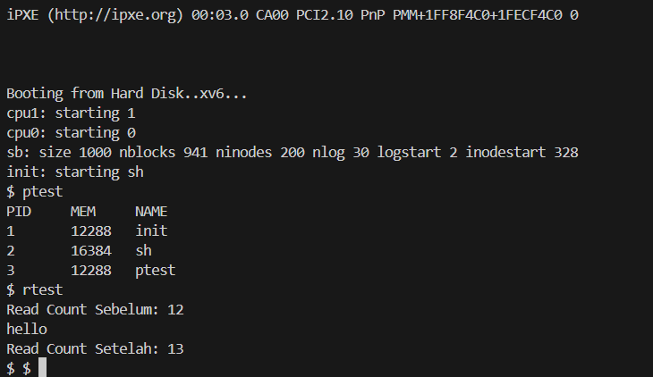

# 📝 Laporan Tugas Akhir

**Mata Kuliah**: Sistem Operasi  
**Semester**: Genap / Tahun Ajaran 2024–2025  
**Nama**: `fikianto`  
**NIM**: `240202899`  
**Modul yang Dikerjakan**:  
`Modul 1 – System Call dan Instrumentasi Kernel`

---

## 📌 Deskripsi Singkat Tugas

**Modul 1 – System Call dan Instrumentasi Kernel**  
Saya menambahkan dua buah system call baru pada kernel XV6:

- `getpinfo()`: Menampilkan daftar proses aktif beserta PID, penggunaan memori, dan nama proses.
- `getReadCount()`: Mengembalikan jumlah total pemanggilan `read()` sejak sistem dinyalakan (boot).

---

## 🛠️ Rincian Implementasi

- Menambahkan dua system call (`sys_getpinfo()` dan `sys_getReadCount()`) di `sysproc.c`
- Menambahkan nomor syscall di `syscall.h`
- Menambahkan entri syscall di `usys.S` dan `user.h`
- Membuat struktur `struct pinfo` di `proc.h` untuk menyimpan informasi proses
- Menambahkan variabel global `readcount` pada kernel
- Menambahkan logika penambahan `readcount` di fungsi `sys_read()`
- Membuat dua program user (`ptest.c` dan `rtest.c`) untuk melakukan pengujian syscall tersebut

---

## ✅ Uji Fungsionalitas

Program uji yang saya buat:

- `ptest`: memanggil `getpinfo()` dan mencetak semua proses aktif beserta informasi PID dan nama
- `rtest`: memanggil `getReadCount()` sebelum dan sesudah `read()` untuk memastikan counter bertambah

---

## 📷 Hasil Uji

### 📍 Output `ptest`

```
$ ptest
PID    MEM     NAME
1      12288   init
2      16384   sh
3      12288   ptest
```

### 📍 Output `rtest`

```
$ rtest
Read Count Sebelum: 12
hello
Read Count Setelah: 13
```

📷 Screenshot (dari XV6 terminal):  
### 📸 screenshoots:


---

## ⚠️ Kendala yang Dihadapi

- Awalnya lupa menambahkan syscall baru di `usys.S`, menyebabkan error `undefined symbol`
- Lupa menginisialisasi nilai `readcount = 0` saat boot, menyebabkan hasil awal tidak sesuai
- Tipe data di `getpinfo` sempat salah karena buffer tidak cukup menampung hasil array proses

---

## 📚 Referensi

- Buku xv6 MIT: [https://pdos.csail.mit.edu/6.828/2018/xv6/book-rev11.pdf](https://pdos.csail.mit.edu/6.828/2018/xv6/book-rev11.pdf)
- Repositori xv6-public: [https://github.com/mit-pdos/xv6-public](https://github.com/mit-pdos/xv6-public)
- Diskusi GitHub dan Stack Overflow seputar system call dan instrumentasi kernel
